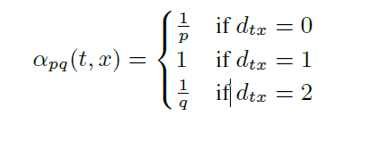
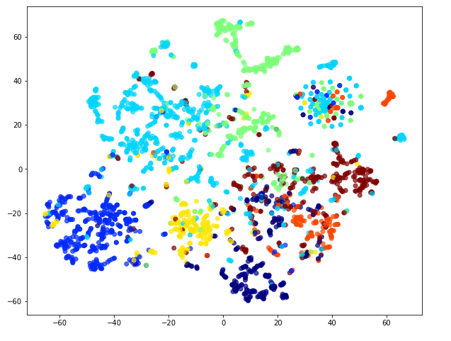

# node2vec: Scalable Feature Learning for **Networks**

### Breif Review

-   이웃 노드를 찾아서 벡터화하는 새로운 아이디어를 제시했다.
-   BFS와 DFS방식을 섞어 놓은 방법이라고 한다.
-   메인 아이디어는 2nd order random-walk방식이며 도착한 뒤에는 p, q두가지 파라미터가 활용된다.
    -   p: node를 재방문하는 가능도를 컨트롤하고
    -   q: node기준으로 밖으로 갈 것인지 안으로 갈 것인지를 계산함



-   BFS/DFS에 비해 공간적/시간적으로 이점이 있다고 주장
-   neighbors를 찾고 이 후 임베딩 등을 통해 분석함

#### Description from StellarGraph

```markdown
- The Node2Vec and Deepwalk algorithms perform unsupervised representation learning for homogeneous networks, taking into account network structure while ignoring node attributes. The node2vec algorithm is implemented by combining StellarGraph's random walk generator with the word2vec algorithm from Gensim. Learned node representations can be used in downstream machine learning models implemented using Scikit-learn, Keras, Tensorflow or any other Python machine learning library.
```


### Code Review

-   논문에서 주장한 방식은 BiasedRandomWalk로 구현되어 있음

```python
rw = sg.data.BiasedRandomWalk(G)
walks = rw.run(nodes, n=2, length=80, p=0.5, q=1)
```

-   n에 따라서 반복한 만큼 이웃이 구해짐
    -   ex) n_row = 10, n=2 => output's n_row=20
-   이웃을 구한 후 임베딩하여 Multi-class 분류문제를 진행할 수 있음
    -   예제에서는 gensim을 사용한 word2vec을 사용(논문 자체에서 이쪽 개념에서 영감을 받았다고 함)

```python
str_walks = [[str(n) for n in walk] for walk in walks] # gensim을 사용하기 위해 str으로 
model = Word2Vec(str_walks, size=128, window=5, min_count=0, sg=1, iter=10)

# 결과
x = model.wv.vectors
```

-   **더 큰 데이터셋에 적용해보려고 했지만 시간이 너무 오래걸림**
    -   ~~논문에서는 큰 데이터 셋에도 잘 적용될 것이라 했는데 구현의 문제인지 데이터 크기의 차이인지..~~



