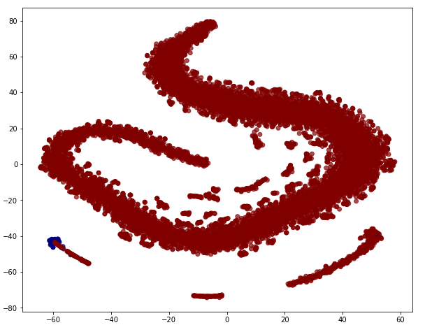

### metapath2vec: Scalable Representation Learning for Heterogeneous NetworksBreif Review

-   그래프 구조가 하나의 형태가 아니라 여러 형태가 존재하는 경우 embedding방법
-   heterogeneous networks를 다루기 위해 고안됨
-   meta-path model과 skip-gram을 결합하여 사용
-   최종적으로 context에 맞춰서 normalize함
-   한계점으로 schema를 미리 정의해서 사용해야 된다는 점이 있음

#### Description from StellarGraph

```markdown
- The metapath2vec algorithm performs unsupervised, metapath-guided representation learning for heterogeneous networks, taking into account network structure while ignoring node attributes. The implementation combines StellarGraph's metapath-guided random walk generator and Gensim word2vec algorithm. As with node2vec, the learned node representations (node embeddings) can be used in downstream machine learning models to solve tasks such as node classification, link prediction, etc, for heterogeneous networks.
```

### Code Review

-   논문에서 주장한 방식은 BiasedRandomWalk로 구현되어 있음

```python
rw = sg.data.BiasedRandomWalk(G)
walks = rw.run(nodes, n=2, length=80, p=0.5, q=1)
```

-   n에 따라서 반복한 만큼 이웃이 구해짐
    -   ex) n_row = 10, n=2 => output's n_row=20
-   이웃을 구한 후 임베딩하여 Multi-class 분류문제를 진행할 수 있음
    -   예제에서는 gensim을 사용한 word2vec을 사용(논문 자체에서 이쪽 개념에서 영감을 받았다고 함)

```python
str_walks = [[str(n) for n in walk] for walk in walks] # gensim을 사용하기 위해 str으로 
model = Word2Vec(str_walks, size=128, window=5, min_count=0, sg=1, iter=1)

# 결과
x = model.wv.vectors
```

-   시각화 및 테스트 결과를 보면 상당히 성능이 우수한 것을 확인



-   **더 큰 데이터셋에 적용해보려고 했지만 시간이 너무 오래걸림**
