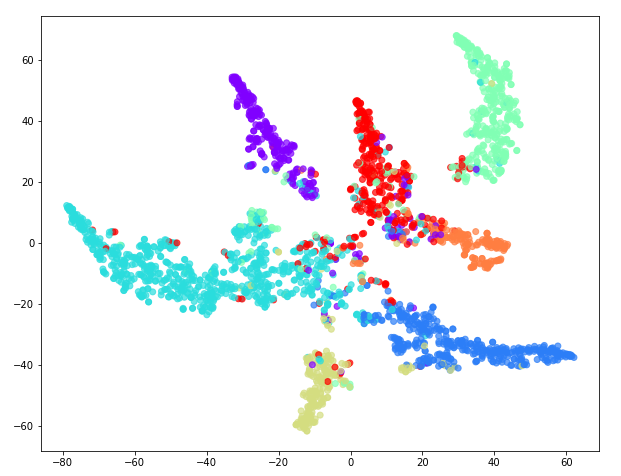

# Simplifying Graph Convolutional Networks

### Breif Review

-   GCN의 간소화 버전
-   더 빠르고 효율적인 적용을 위해 고안됨
-   GCN의 이득이 local averaging으로 부터 온다고 가정(비선형 변환이아니라)
-   위 가정으로 인해 S의 제곱항만 남아 계산상 간편해짐

#### Description from StellarGraph

```markdown
- The SGC network algorithm supports representation learning and node classification for homogeneous graphs. It is an extension of the GCN algorithm that smooths the graph to bring in more distant neighbours of nodes without using multiple layers.
```

### Code Review

-   GCN의 간소화 버전으로 볼 수 있으므로 유사

#### Node Classification

-   full batch 방식

```python
from stellargraph.mapper import FullBatchNodeGenerator

generator = FullBatchNodeGenerator(G, method="sgc", k=2)
```

-   논문에서 주장하는 바로는 바로 classify 함수를 붙임

```python
gcn = GCN(layer_sizes=[tr_target.shape[1]], activations=['softmax'], generator=generator, dropout=0.5, bias=True)

# build network
nc_inp, nc_out = gcn.build()

nc_model = Model(inputs=nc_inp, outputs=nc_out)
nc_model.compile(
    optimizer=optimizers.Adam(lr=1e-3),
    loss='categorical_crossentropy',
    metrics=["acc"],
)
```

-   시각화 결과도 유사한 양상을 보여줌 



