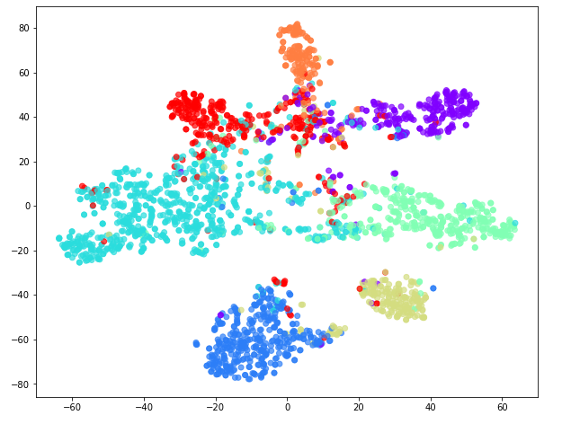

# Cluster-GCN: An Efficient Algorithm for Training Deep and Large Graph Convolutional Networks

### Breif Review

-   시간/공간적 효율성을 고려하기 위해 디자인됨
-   효율성을 높이기 위해 mini-batch SGD방식을 사용
-   노드를 나누어서(clustering) forward/back propagation 방식으로만 작동하게 만듬
    -   이 때 clusetering 개수 n은 random보다 metis방식을 사용하면 좋음

#### Description from StellarGraph

```markdown
- An extension of the GCN algorithm supporting representation learning and node classification for homogeneous graphs. Cluster-GCN scales to larger graphs and can be used to train deeper GCN models using Stochastic Gradient Descent.
```

### Code Review

-   다른 모형들과 비교하여 clusetring 과정 때문에 약간 다른 흐름을 가짐
-   metis방식은 아직 구현하지 못함

#### Node Classification

-   노드를 cluster로 분류하여 추출 함
-   이 때 metis방식을 사용하면 cluster 개수 n을 선택할 수 있음

```python
from stellargraph.mapper import ClusterNodeGenerator
        
generator = ClusterNodeGenerator(G, clusters=10, q=10, name='generator') # q: clusters per batch

```

-   마지막 층에 flatten이 있어야 predict 역할을 할 수 있음
    -   있는 채로 훈련은 안됨

```python
from stellargraph.layer import ClusterGCN
import tensorflow.keras.backend as K
# like keras models
gcn = ClusterGCN(layer_sizes=[32, 32], activations=['elu', 'elu'], generator=generator, dropout=0.5, bias=True)

# build network
nc_inp, nc_out = gcn.build()

nc_layer = layers.Dense(16, activation='relu')(nc_out)
nc_layer = layers.Dense(tr_target.shape[1], activation='softmax')(nc_layer)

nc_model = Model(inputs=nc_inp, outputs=nc_layer)
nc_model.compile(
    optimizer=optimizers.Adam(lr=1e-3),
    loss=losses.categorical_crossentropy,
    metrics=["acc"],
)

pred_layer = layers.Lambda(lambda x: K.squeeze(x, 0))(nc_layer)
pred_model = Model(nc_inp, pred_layer)
```

-   예측을 할 때 index가 달라져 있기 때문에 맞춰주는 과정이 필요함
    -   해당 과정은 함수를 통해서 flow가 통과하면 생김

```python
from sklearn.metrics import f1_score

res = list(map(np.argmax, pred_model.predict(test_flow)))
test_label = list(map(np.argmax, test_target.loc[test_flow.node_order].values))

f1_micro = f1_score(test_label, res, average='micro')
f1_marco = f1_score(test_label, res, average='macro')

print('f1_micro:', round(f1_micro,3), '\nf1_macro:', round(f1_marco, 3)) 
```



