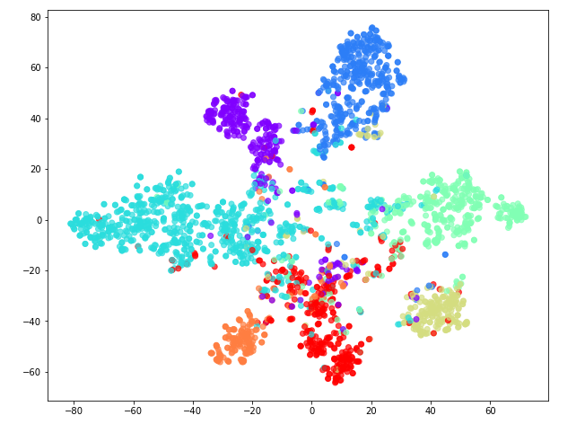

# GRAPH ATTENTION NETWORKS

### Brief Review

-   aggregator로 attention mechanism을 사용
-   인접행렬을 분해(decomposition)하지 않기 때문에 계산상 이점을 가져올 뿐만 아니라 다음과 같은 효 과가 있음
    -   같은 이웃을 가지고 있는 노드에게 다른 importance를 줄 수 있음
    -   노드에 해당하는 attention score를 알 수 있기 때문에 해석이 용이함
    -   방향그래프에 사용할 수 있음
    -   graphsage가 언급했던 inductive 한 방식임

#### Description from StellarGraph

```markdown
- The GAT algorithm supports representation learning and node classification for homogeneous graphs. There are versions of the graph attention layer that support both sparse and dense adjacency matrices.
```

### Code Review

-   여태 다른 방식들과 비교되는 점은 무엇보다 속도
    -   논문에서 언급하길 계산속도를 빠르게 했다고 했는데 정말 빠르게 적용이 됨

#### Node Classification

-   GAT방식은 batch generator 방식이므로 FullBatchNodeGenerator를 사용

```python
from stellargraph.mapper import FullBatchNodeGenerator

generator = FullBatchNodeGenerator(G, method="gat")
```

-   attention_head를 설정하여 multi-head attention 방식을 사용할 수 있음

```python
from stellargraph.layer import GAT

gat = GAT(layer_sizes=[32, 32], activations=['elu', 'elu'], generator=generator, attn_heads=8, drop_out=0.5)
nc_inp, nc_out = gat.build()
```

-   임베딩 이후 tsne방식으로 시각화 결과를 보면 GraphSAGE방식과 비슷해 보임



#### Link Prediction

-   다른 방식들과 유사하게 edge_splitter를 사용하여 edge 제거 및 예측 모델 만듬
-   위에서 언급한대로 FullBatchLinkGenerator을 사용

```python
from stellargraph.mapper import FullBatchLinkGenerator

train_gen = FullBatchLinkGenerator(G_train, method="gat")
train_flow = train_gen.flow(edge_ids_train, edge_labels_train)

test_gen = FullBatchLinkGenerator(G_test, method="gat")
test_flow = test_gen.flow(edge_ids_test, edge_labels_test)
```

-   몇개의 층을 한번에 처리해주는 link_classification함수는 가끔 오류가 남
    -   LinkEmbedding사용하면 문제 없이 적용 가능

```python
from stellargraph.layer import link_classification, LinkEmbedding

prediction = LinkEmbedding(activation="sigmoid", method="ip")(out)
prediction = layers.Reshape((-1,))(prediction)

lp_model = Model(inp, prediction)

lp_model.compile(
    optimizer=optimizers.Adam(lr=1e-2),
    loss=losses.binary_crossentropy,
    metrics=["acc"],
)
```

